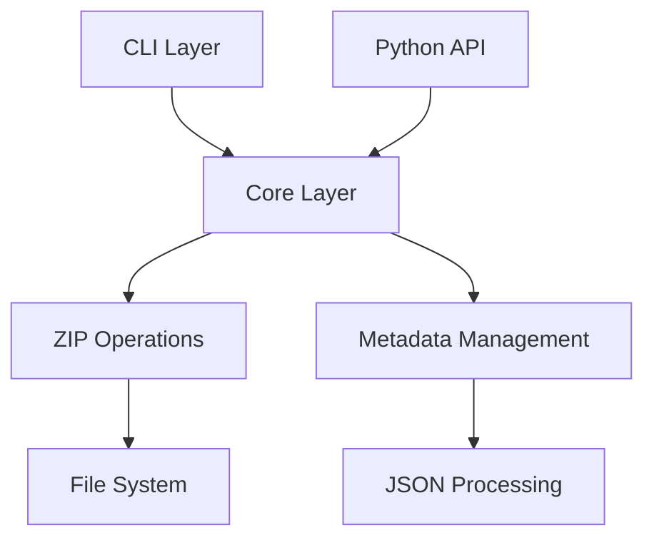
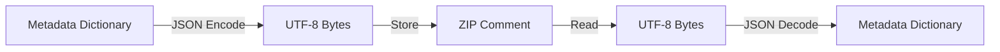
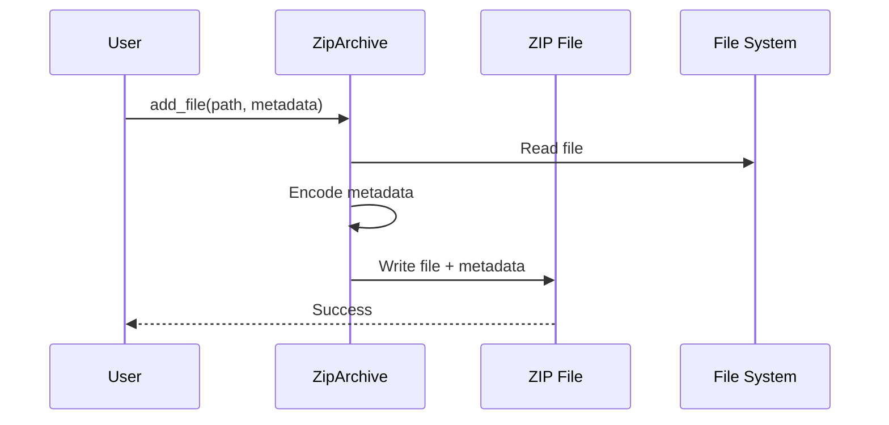
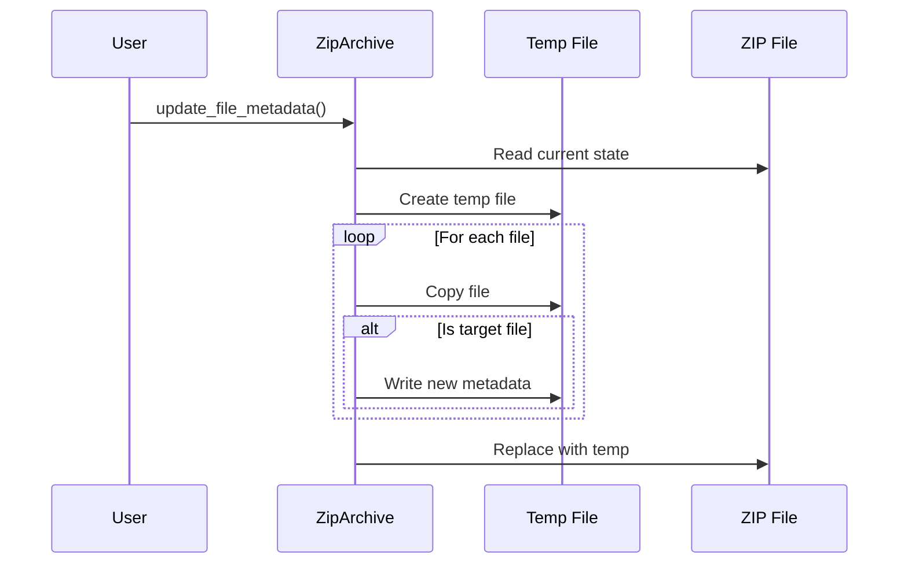

# Implementation Details

This page provides technical details about Zipper's implementation, architecture, and design decisions.

## Architecture Overview

Zipper is built with a layered architecture:



### Layers

1. **Interface Layer**
   - Command Line Interface (CLI)
   - Python API
   - Both interfaces use the same core functionality

2. **Core Layer**
   - ZIP archive operations
   - Metadata management
   - Error handling
   - Type validation

3. **Storage Layer**
   - File system operations
   - ZIP file format handling
   - JSON encoding/decoding

## Metadata Storage

Zipper stores metadata using ZIP file comments:



### Process

1. **Encoding**
   ```python
   metadata_dict = {"key": "value"}
   json_str = json.dumps(metadata_dict)
   comment_bytes = json_str.encode('utf-8')
   ```

2. **Storage**
   - File comments: Stored in the ZIP file's central directory
   - Archive comments: Stored in the end of central directory record

3. **Decoding**
   ```python
   comment_bytes = zip_info.comment
   json_str = comment_bytes.decode('utf-8')
   metadata_dict = json.loads(json_str)
   ```

## File Operations

### Adding Files



### Updating Metadata



## Performance Considerations

1. **Memory Usage**
   - Files are processed in chunks
   - Metadata is kept in memory
   - Large archives are handled efficiently

2. **Temporary Files**
   - Used only when updating metadata
   - Automatically cleaned up
   - Safe atomic operations

3. **Caching**
   - Metadata cache for frequently accessed items
   - Cache invalidation on updates
   - Thread-safe operations

## Error Handling

### Validation Layers

1. **Input Validation**
   ```python
   def add_file(self, filepath: str, metadata: Optional[Dict[str, Any]] = None):
       if not os.path.exists(filepath):
           raise FileNotFoundError(f"File not found: {filepath}")
   ```

2. **Metadata Validation**
   ```python
   def _encode_metadata(self, metadata: Dict[str, Any]) -> bytes:
       try:
           return json.dumps(metadata).encode('utf-8')
       except (TypeError, ValueError) as e:
           raise ValueError(f"Invalid metadata format: {e}")
   ```

3. **State Validation**
   ```python
   def _check_open(self):
       if not self.archive:
           raise RuntimeError("Archive not opened. Use with context manager.")
   ```

## Thread Safety

1. **Context Manager**
   - Safe resource acquisition and release
   - Automatic cleanup on errors

2. **File Operations**
   - Atomic file replacements
   - Temporary file handling

3. **Metadata Updates**
   - Copy-on-write for updates
   - Thread-safe metadata cache

## Future Improvements

1. **Planned Features**
   - Async/await support
   - Streaming large files
   - Compression options
   - Encryption support

2. **Optimizations**
   - Metadata indexing
   - Parallel processing
   - Memory usage improvements

3. **Extensions**
   - Plugin system
   - Custom metadata validators
   - Additional archive formats 